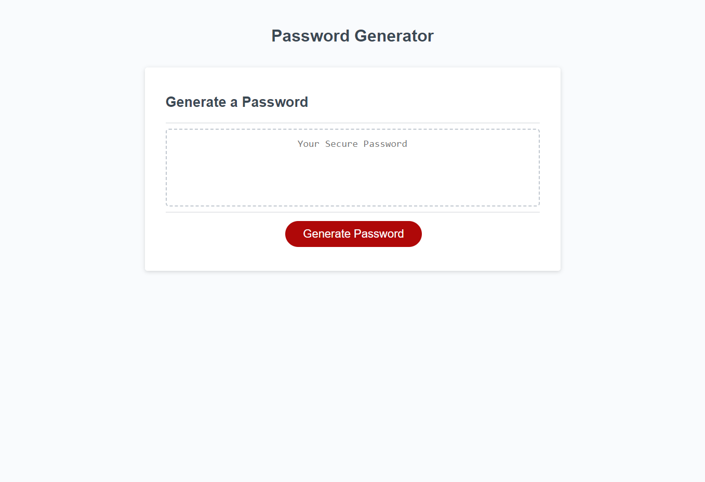

# Password-Generator

# User Story

* AS AN employee with access to sensitive data
* I WANT to randomly generate a password that meets certain criteria
* SO THAT I can create a strong password that provides greater security

## Acceptance Criteria

* GIVEN I need a new, secure password
* WHEN I click the button to generate a password
* THEN I am presented with a series of prompts for password criteria
* WHEN prompted for password criteria
* THEN I select which criteria to include in the password
* WHEN prompted for the length of the password
* THEN I choose a length of at least 8 characters and no more than 128 characters
* WHEN asked for character types to include in the password
* THEN I confirm whether or not to include lowercase, uppercase, numeric, and/or special characters
* WHEN I answer each prompt
* THEN my input should be validated and at least one character type should be selected
* WHEN all prompts are answered
* THEN a password is generated that matches the selected criteria
* WHEN the password is generated
* THEN the password is either displayed in an alert or written to the page

## Challenges

* It was diffucult to visualize what I was requested to do. I understood the concept but was lost in the beginning. What helped me was psuedo coding and breaking down the function in which I needed to create in more palatable concepts. Knowing so little about coding still, my mind tries to over-complicate the objective by thinking in a more grandiose way. After acknowledging the inadequate thinking pattern it helped to break things down and research how to do things step by step. I used a mixture of course material, youtube, old github repos, and google to finally get it to work as well as understand what I was coding.

## WEBSITE LINK
https://akash301994.github.io/Password-Generator/

## Website Screenshot
